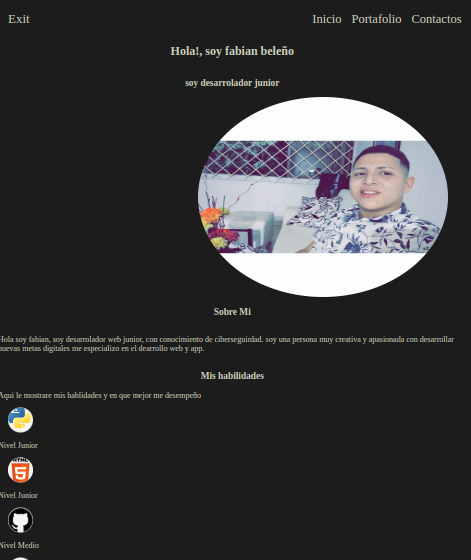
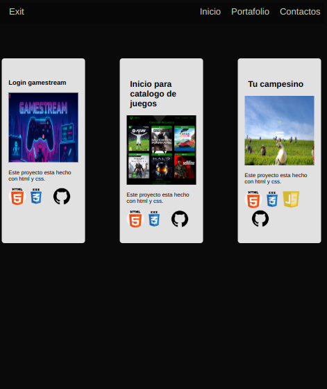

# Fabian Web

Primero veremos el index aqui esta la primera vista:

podemos observar que se entuentra el "header" que son los valores ("fabian web" / "inicio","portafolio" y contacto.)

despues vemos la primera seccion que es mi perfil personal:

# mi perfil personal

al darle clik nos mostrara esta vista:

# mis proyectos

aquin ven mis proyectos:

